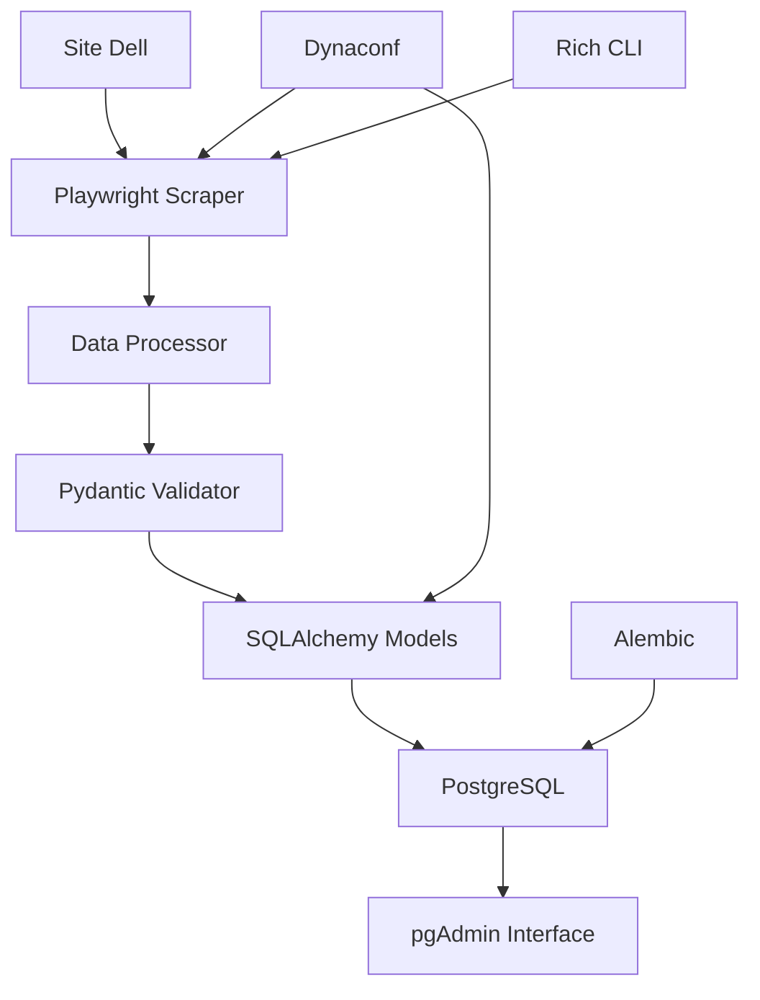

# 🖥️ Dell Products Scraper

> Web scraper profissional para coleta e armazenamento de produtos Dell com pipeline completo de dados.

## 📋 Sobre o Projeto

Sistema de web scraping desenvolvido para coletar informações de produtos do site oficial da Dell, processar os dados e armazená-los em banco PostgreSQL com interface de gerenciamento.

### 🎯 Objetivos
- **Coleta automatizada** de produtos Dell (modelo, preço, links)
- **Armazenamento estruturado** em PostgreSQL
- **Pipeline robusto** de processamento de dados
- **Arquitetura escalável** e containerizada

## 🛠️ Stack Tecnológica

### **Core Technologies**
- **Python 3.13** - Linguagem principal
- **PostgreSQL 16** - Database relacional
- **Docker & Docker Compose** - Containerização

### **Web Scraping**
- **Playwright 1.55+** - Automação web moderna
- **Rich 14.1+** - Interface CLI profissional

### **Database & ORM**
- **SQLAlchemy 2.0+** - ORM e abstração de dados
- **Alembic 1.16+** - Migrações de schema
- **psycopg2-binary 2.9+** - Driver PostgreSQL

### **Configuration & Data**
- **Dynaconf 3.2+** - Gerenciamento de configurações
- **Pydantic 2.11+** - Validação de dados
- **Pandas 2.3+** - Processamento de dados

### **Development Tools**
- **uv** - Gerenciador de dependências moderno
- **Structlog 25.4+** - Logging estruturado
- **Tenacity 9.1+** - Retry automático
- **pgAdmin 4** - Interface de administração DB

## 🏗️ Arquitetura do Sistema



### **Separação de Responsabilidades**
```
📁 src/dell/
├── 📂 config/          # Configurações (Dynaconf)
├── 📂 models/          # SQLAlchemy Models
├── 📂 scraper/         # Lógica de web scraping
├── 📂 services/        # Regras de negócio  
├── 📂 repositories/    # Acesso a dados
└── 📂 utils/           # Utilitários gerais
```

## 🗄️ Schema do Banco de Dados

### **Tabelas Principais**

#### **Categories**
- `id` (PK) - Identificador único
- `name` - Nome da categoria (ex: "Laptops")
- `slug` - URL-friendly identifier
- `created_at`, `updated_at`, `is_active` - Auditoria

#### **Products**  
- `id` (PK) - Identificador único
- `model` - Modelo do produto Dell
- `price` - Preço (DECIMAL 10,2)
- `link` - URL do produto no site Dell
- `category_id` (FK) - Referência para Categories
- `created_at`, `updated_at`, `is_active` - Auditoria

### **Relacionamentos**
- **1:N** - Uma categoria pode ter múltiplos produtos
- **Foreign Key** com integridade referencial

## ⚙️ Configuração Segura

### **Multi-Ambiente**
```toml
# settings.toml
[development]
debug = true
scraping_delay = 1

[production]  
debug = false
scraping_delay = 3
```

### **Secrets Management**
```toml
# .secrets.toml (git ignored)
[default]
POSTGRES_PASSWORD = "secure_password"
POSTGRES_USER = "dell_user"
```

### **Environment Variables**
```bash
# .env (git ignored)
ENV_FOR_DYNACONF=development
POSTGRES_DB=dell_db
POSTGRES_USER=dell_user
POSTGRES_PASSWORD=dev_password_123
```

## 🐳 Containerização

### **Docker Compose Services**
- **PostgreSQL 16-Alpine** - Database principal
- **pgAdmin 4** - Interface web de administração
- **Volumes persistentes** - Dados preservados
- **Rede isolada** - Comunicação entre containers

## 🚀 Setup e Instalação

### **Pré-requisitos**
- Python 3.13+
- Docker & Docker Compose
- uv package manager

### **1. Clone e Setup**
```bash
git clone <repository>
cd dell
cp .env.example .env
# Editar credenciais no .env
```

### **2. Instalar Dependências**
```bash
uv sync
uv run playwright install chromium
```

### **3. Subir Infraestrutura**
```bash
docker-compose up -d postgres
docker-compose up -d pgadmin  # Opcional
```

### **4. Setup Database**
```bash
# Aplicar migrações
uv run alembic upgrade head

# Verificar tabelas criadas
docker exec -it dell_postgres psql -U dell_user -d dell_db -c "\dt"
```

### **5. Acessar pgAdmin (Opcional)**
- **URL:** http://localhost:8080
- **Email:** admin@dell.com
- **Password:** admin_dev_123

**Configurar conexão:**
- **Host:** postgres
- **Port:** 5432
- **Database:** dell_db
- **Username:** dell_user  
- **Password:** [seu_password_do_.env]

## 📊 Metodologia de Desenvolvimento

### **Abordagem Bottom-Up**
1. **🏗️ Infrastructure First** - Docker, PostgreSQL, configurações
2. **🗄️ Database Layer** - Models, relacionamentos, migrações  
3. **⚙️ Configuration Management** - Dynaconf, secrets, ambientes
4. **🕸️ Business Logic** - Scrapers, services, pipeline
5. **💻 User Interface** - CLI, comandos, feedback
6. **🧪 Testing & Quality** - Testes, validações
7. **🐳 Deployment** - Containerização completa

### **Princípios Aplicados**
- **Separation of Concerns** - Cada camada tem responsabilidade única
- **Database First** - Schema bem definido antes da lógica
- **Configuration Management** - Ambientes e secrets organizados
- **Containerization** - Infraestrutura reproduzível
- **Type Safety** - Pydantic + SQLAlchemy para validação

## 🔄 Migrações de Database

```bash
# Gerar nova migração
uv run alembic revision --autogenerate -m "Descrição da mudança"

# Aplicar migrações
uv run alembic upgrade head

# Ver histórico
uv run alembic history

# Rollback se necessário  
uv run alembic downgrade -1
```

## 📈 Status do Projeto

### **✅ Implementado**
- ✅ Infraestrutura Docker completa
- ✅ Models SQLAlchemy com relacionamentos
- ✅ Sistema de migrações Alembic
- ✅ Configuração multi-ambiente segura
- ✅ Database PostgreSQL funcional
- ✅ Interface pgAdmin configurada

### **🔄 Em Desenvolvimento**
- 🔄 Web scraper Playwright
- 🔄 Pipeline de processamento
- 🔄 CLI interface Rich
- 🔄 Sistema de logs estruturado

### **⏳ Planejado**
- ⏳ Testes automatizados
- ⏳ Containerização da aplicação
- ⏳ CI/CD pipeline
- ⏳ Monitoramento e alertas

## 👨‍💻 Desenvolvimento

### **Comandos Úteis**
```bash
# Ambiente desenvolvimento
uv sync
export ENV_FOR_DYNACONF=development

# Subir infraestrutura
docker-compose up -d

# Aplicar migrações
uv run alembic upgrade head

# Ver logs
docker-compose logs postgres
docker-compose logs pgadmin
```

## 📄 Licença

Este projeto é desenvolvido para fins educacionais e de demonstração técnica.

---

**Desenvolvido com metodologia enterprise-grade para demonstrar boas práticas de arquitetura de software e engenharia de dados.** 🏆